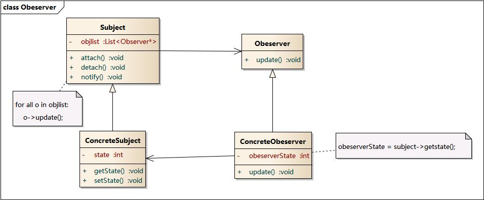

# ReactiveX是什么
ReactiveX是Reactive Extensions的缩写，一般简写为Rx，最初是LINQ的一个扩展，由微软的架构师Erik Meijer领导的团队开发，在2012年11月开源，Rx是一个编程模型，目标是提供一致的编程接口，帮助开发者更方便的处理异步数据流，Rx库支持.NET、JavaScript和C++，Rx近几年越来越流行了，现在已经支持几乎全部的流行编程语言了，Rx的大部分语言库由ReactiveX这个组织负责维护，比较流行的有RxJava/RxJS/Rx.NET，社区网站是 reactivex.io。

微软给的定义是，Rx是一个函数库，让开发者可以利用可观察序列和LINQ风格查询操作符来编写异步和基于事件的程序，使用Rx，开发者可以用Observables表示异步数据流，用LINQ操作符查询异步数据流，用Schedulers参数化异步数据流的并发处理，Rx可以这样定义： ReactiveX = Observables + LINQ + Schedulers

# 解决什么问题
  * 函数式风格：对可观察数据流使用无副作用的输入输出函数，避免了程序里错综复杂的状态
  * 简化代码：Rx的操作符通通常可以将复杂的难题简化为很少的几行代码
  * 异步错误处理：传统的try/catch没办法处理异步计算，Rx提供了合适的错误处理机制
  * 轻松使用并发：Rx的Observables和Schedulers让开发者可以摆脱底层的线程同步和各种并发问题

-------------------------------
## ReactiveX的几个基本概念：
* Observable
  * 观察者模式
  
  * observable

    observable相比观察者模式多了两个方法,onCompleted和onError
* Operators
  * develop a custom operator
* Single
  a special observable,只发射一个值，onSuccess or onError
* Subject
* Scheduler 调度器

References:
* [ReactiveX官网](http://reactivex.io)
